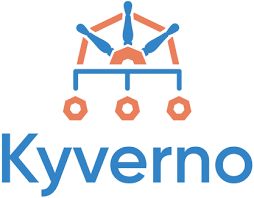

<h1 align="center">Hello 👋, I'm Dheeraj Kumar 🧑🏻 </h1>

## 🌱 About Me

I'm a driven software engineer at *Nokia* 🚀, with a knack for cloud automation, containerization, and tackling complex challenges in Java, Python, Go, C++, and C. I bring a solid mix of technical expertise and a passion for continuous growth and collaboration. Here are a few highlights about me:

- **Team Player** 🤼: Eager to lend a hand, making our collective journey forward as fun as it is fruitful.
- **Knowledge Seeker** 🕵️‍♂️: Forever exploring new technologies, turning curiosity into expertise.
- **Fun-Loving Collaborator** 😄: Convinced that the best solutions come from teams who laugh together. I aim to be the spark that ignites creativity and enthusiasm in my team.

---

<!--  

  

 -->

### Connect with me:

### Languages:

<!-- Backend Languages -->

<!-- Frontend Languages -->

 

### Software and Tools:

<!-- Cloud-related tools -->

<!-- Testing tools -->

  <!-- Adds spaces after new line -->

<!-- Mathematical and Python libraries -->

<!-- Mobile Application Development tools -->

<!-- Database tools -->

  <!-- Adds spaces after new line -->

<!-- Remaining tools -->

 

### Currently Learning:

<!-- Cloud related tools and Languages -->

 

---

<!-- <h3 align="center">📊 My GitHub Stats</h3>

  

  

 -->

<h3 align="center">📈 My Contributions</h3>

  

